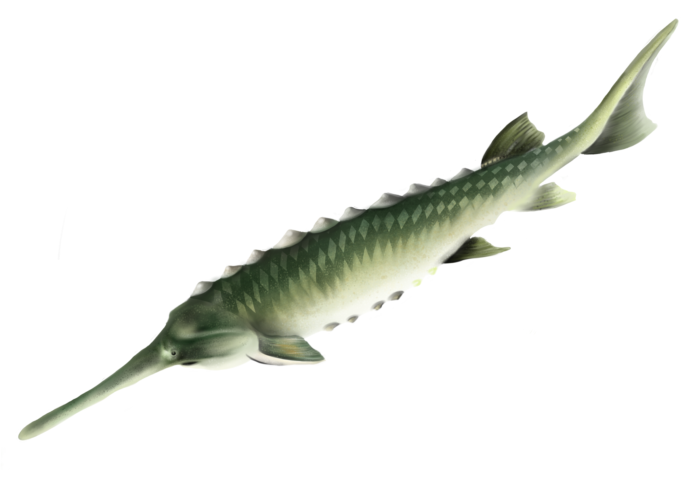

# sturddle-chess-app
## Casual Offline Chess App
- Original <a href="https://github.com/cristivlas/sturddle-chess-engine">hybrid chess engine</a> (C++/Cython)
- Built-in board editor
- Turn AI off / on
- Copy / paste game in PGN format (including comments)
- Voice interaction (optional offline speech recognition on desktop via Deepspeech)
- Optional opening book(s)
- Built-in puzzle collection
- Built with Kivy and Python Chess


<a href="https://en.wikipedia.org/wiki/Sturddlefish"><a/>
# Build on desktop (requires Python3.8 or higher)
***NOTE there's currently an issue with deepspeech-tflite==0.9.3 and Python 3.10***
```
git clone --recursive https://github.com/cristivlas/sturddle-chess-app sturddle
cd sturddle
python3 -m pip install -r requirements.txt

# build the engine (requires C++ compiler on the machine)
cd sturddle_chess_engine                                               
python3 setup.py build_ext --inplace 

# now run it
cd ..
python3 main.py
```

# Build Android image
```
git clone --recursive https://github.com/cristivlas/sturddle-chess-app sturddle
python3 -m pip install buildozer
cd sturddle
python3 -m buildozer android debug

# image should now be in sturddle/bin, use adb to deploy it
# adb install bin/<image-file>.apk

```
